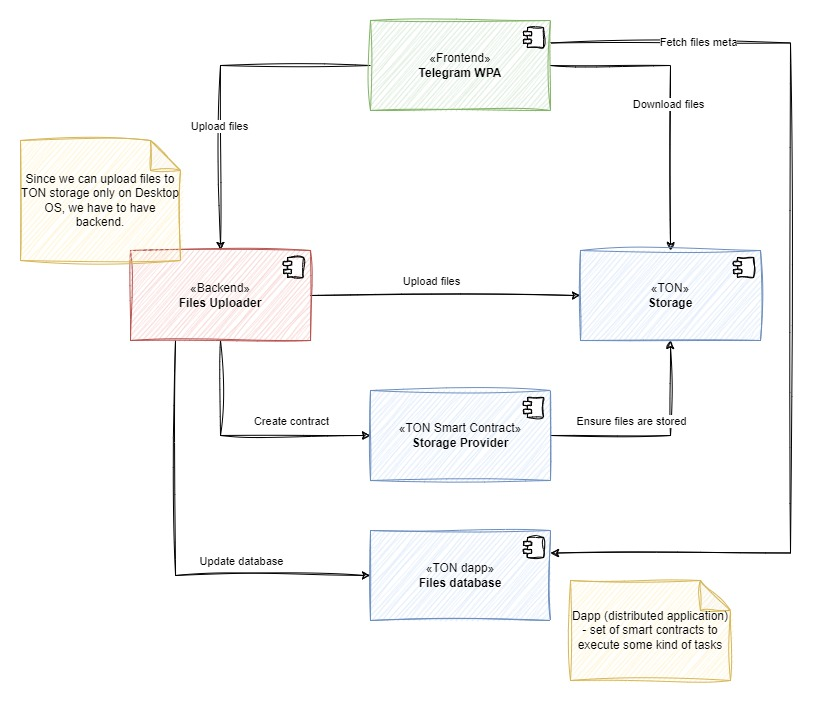

# TON Drive Architecture

**TON Drive** functionality should be built around the [TON Storage](https://docs.ton.org/participate/ton-storage/storage-daemon) and the [Storage Provider](https://docs.ton.org/participate/ton-storage/storage-provider). In order to implement this functionality 3 high level components are required:
1. **Telegram Web Application** - frontend part with interface for user interaction
2. **Files Uploader** - backend part for uploading files to TON Storage
3. **Files Database** - set of smart contracts for storing files metadata

> Original file is hosted [there](https://drive.google.com/file/d/1FfCCwNm0a8AX4yYIrqrhrEIS1i8xgq7Q/view?usp=sharing).

## Components

### Telegram Web Application

Simple [telegram web application](https://core.telegram.org/bots/webapps) with following functionality:
1. Browsing your files
2. Uploading files
3. Sharing files

### Files Uploader

TON Storage works like the torrent and it is available only on Desktop OS. So, in order to upload files from mobile devices we need to implement a backend part that will upload files to TON Storage.

> Backend should keep files until they are handled by the Storage Provider.

Also it will be convenient to create files metadata on the backend side.

### Files Database

Some smart contracts for storing files metadata.

```mermaid
---
title: Basic traits
---
classDiagram
    class Deployable
    class Ownable {
      - owner: address
      + get owner()
      - requireOwner()
    }
    class OwnableTransferable {
      - owner: address
      + ChangeOwner(newOwner: address)
    }
    Ownable <|-- OwnableTransferable
```

> All smart contracts should extend `Deployable` and `OwnableTransferable` traits.

```mermaid
---
title: Smart Contracts
---
classDiagram
    class TonDriveMaster {
      - owner: address[admin]
      - personalDriveCount: int
      + get PersonalDriveCount(): int
      + get PersonalDriveAddress(index: int): address[TonDrivePersonalDrive]
    }

    class TonDrivePersonalDrive {
      - owner: address[user]
      - filesStoredCount: int
      - tonDriveMasterAddress: address[TonDriveMaster]
      + get Owner(): address[user]
      + get FilesStoredCount(): int
      + get FileAddress(index: int): address[TonDriveFile]
      + get TonDriveMasterAddress(): address[TonDriveMaster]
    }

    class TonDriveFile {
      - owner: address[user]
      - driveAddress: address[TonDrivePersonalDrive]
      - bagId: string
      - name: string
      - size: int
      + get DriveAddress(): address[TonDrivePersonalDrive]
      + get Owner(): address[user]
      + get BagId(): string
      + get Name(): string
      + get Size(): int
    }

    TonDriveMaster "1" o-- "*" TonDrivePersonalDrive
    TonDrivePersonalDrive "1" o-- "*" TonDriveFile
```
